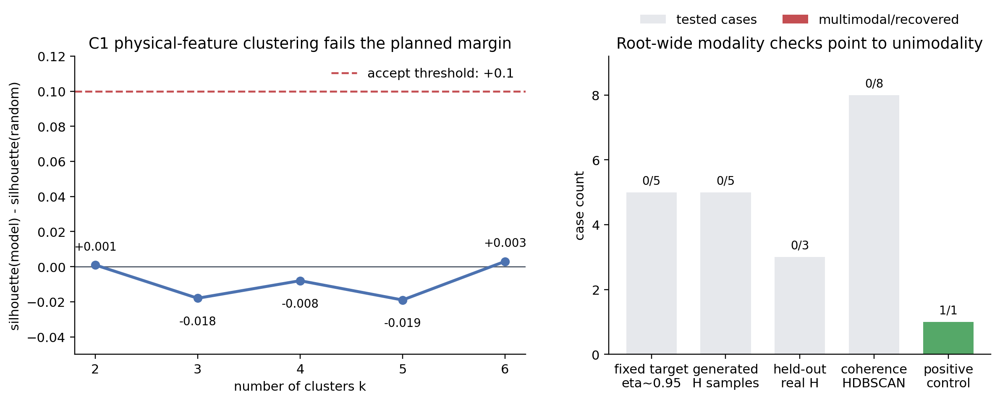
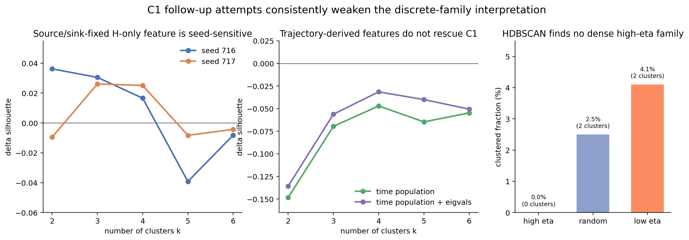
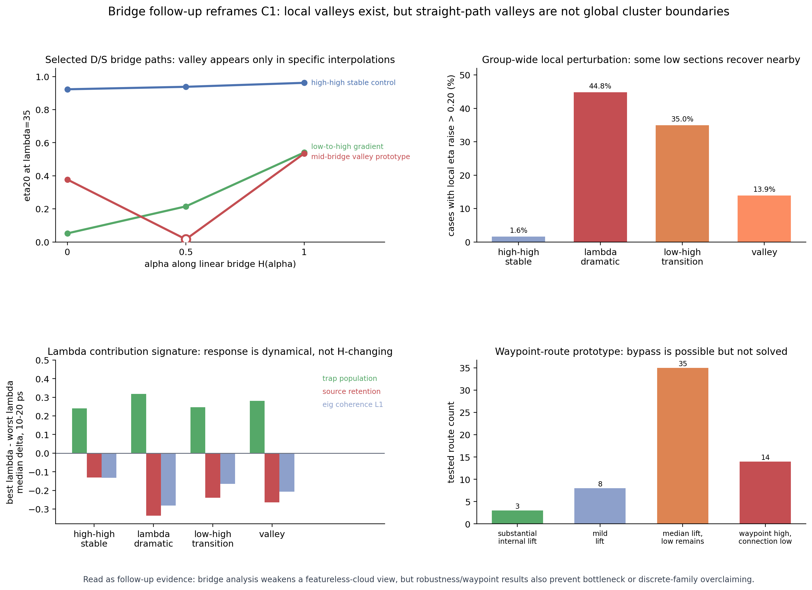
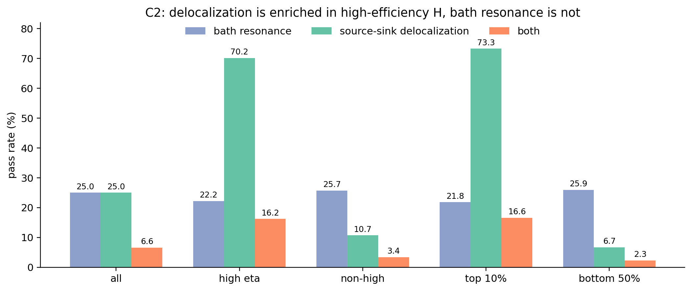
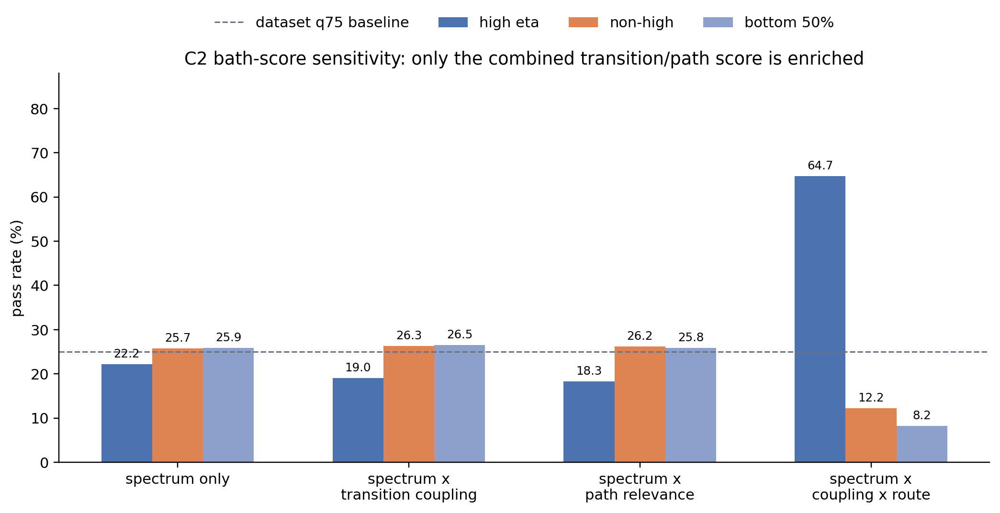
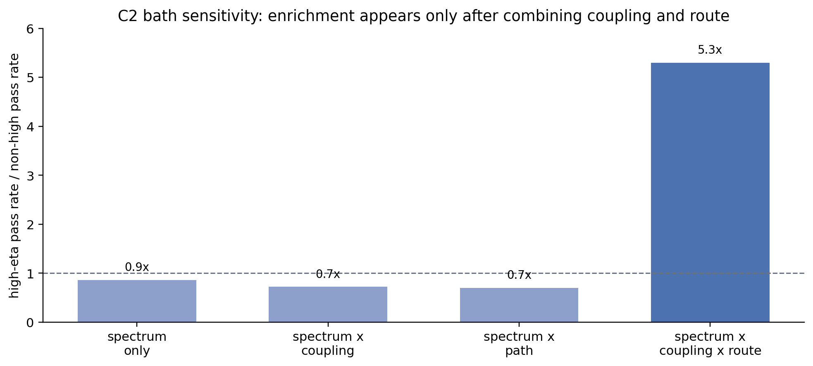
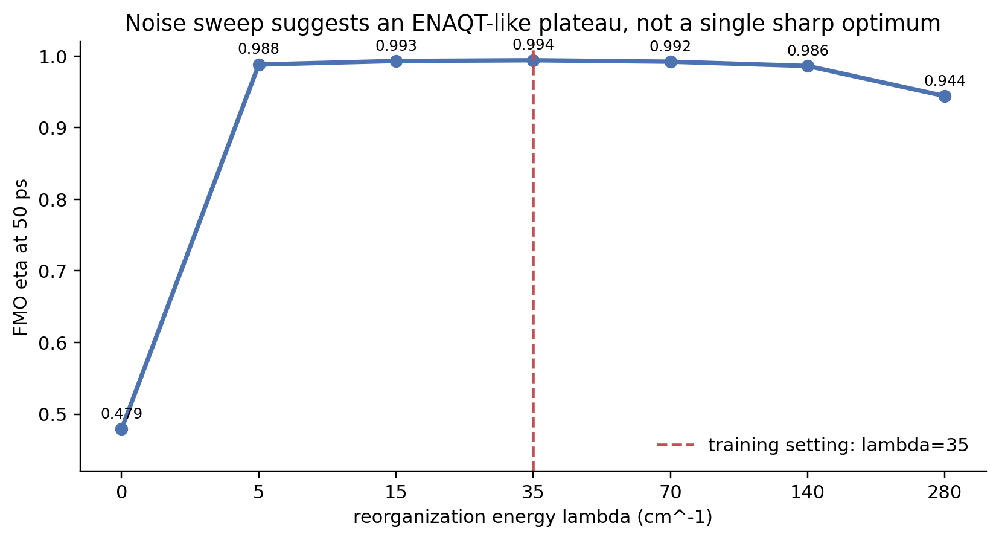
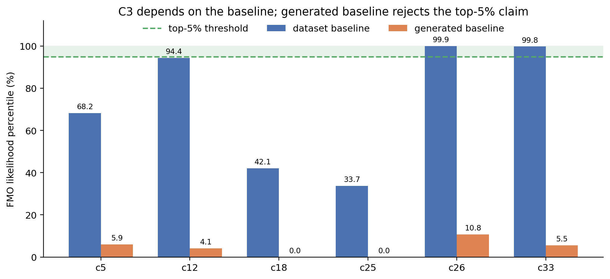
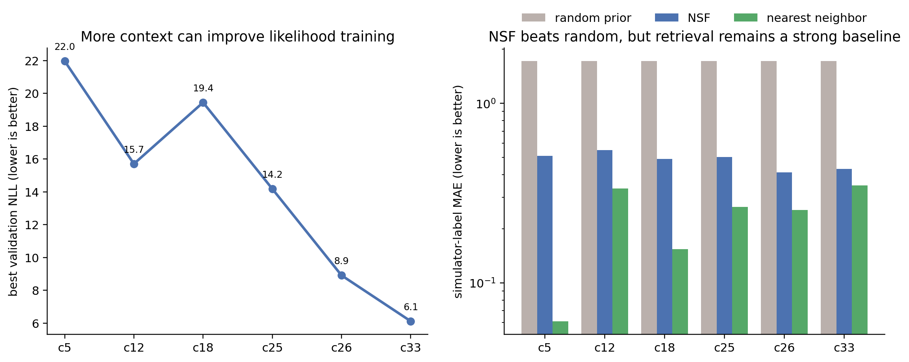

# FMO 조건부 생성 실험의 claim audit과 최종 보고서 구조

이 문서는 생성된 Hamiltonian sample, 실제 FMO Hamiltonian, simulator 재평가 결과, clustering/modality 검정, bridge/path 분석, context ablation 결과를 바탕으로, 처음 제안했던 C1-C3 claim이 현재 실험 결과에서 어느 정도 지지되는지 정리한다. 핵심 목적은 원래 주장을 억지로 긍정하는 것이 아니라, 실제 결과가 말해주는 결론을 최종 보고서에 쓸 수 있는 형태로 재구성하는 것이다.

문서의 구조는 다음 순서로 읽으면 된다.

1. 먼저 원래 claim이 무엇이었고 현재 판정이 어떻게 바뀌었는지 확인한다.
2. 각 claim별로 원 검증 실험과 보강 검증 실험을 분리해서 본다.
3. C1-C3와 별개로, 모델 자체의 조건부 생성 성능을 context ablation으로 확인한다.
4. 마지막에 최종 보고서에 넣을 수 있는 주장과, 더 강한 주장을 위해 필요한 추가 실험을 정리한다.

## 목차

1. [한 페이지 요약](#1-한-페이지-요약)
2. [C1 claim audit: discrete family 가설](#2-c1-claim-audit-discrete-family-가설)
3. [C2 claim audit: mechanistic signature 가설](#3-c2-claim-audit-mechanistic-signature-가설)
4. [C3 claim audit: biology likelihood 가설](#4-c3-claim-audit-biology-likelihood-가설)
5. [모델 후속 분석: context ablation과 baseline](#5-모델-후속-분석-context-ablation과-baseline)
6. [최종 보고서용 claim set](#6-최종-보고서용-claim-set)
7. [남은 추가 실험](#7-남은-추가-실험)

## 1. 한 페이지 요약

| claim | 원래 주장 | 현재 판정 | 최종 보고서에서 안전한 표현 |
|---|---|---|---|
| C1 | high-eta Hamiltonian은 여러 discrete family 또는 cluster로 나뉜다. | 기각 | high-eta 영역은 discrete cluster보다 넓고 연속적인 feasible region에 가깝다. |
| C2 | high-eta Hamiltonian은 bath resonance와 input-sink delocalization을 동시에 만족한다. | 부분 지지 | input-sink delocalization은 강하게 enrichment된다. 단순 bath spectrum score는 약하지만, transition coupling과 route relevance를 함께 반영한 bath score는 high-eta에서 강하게 enrichment된다. |
| C3 | 실제 FMO Hamiltonian은 학습된 `p(H \| c)` 분포의 high-likelihood 영역에 있다. | 기각 | FMO는 높은 eta를 갖지만, 현재 synthetic prior로 학습한 조건부 분포에서는 typical point가 아니다. |
| 후속 분석 | 조건부 생성 모델은 target condition을 반영하는가? | 지지 | NSF는 random prior보다 target condition을 훨씬 잘 맞추지만, nearest-neighbor retrieval은 더 강한 baseline이다. |

따라서 최종 보고서의 중심 메시지는 다음처럼 잡는 것이 가장 방어 가능하다.

> 원래 기대했던 discrete family와 biology-overlap claim은 강하게 지지되지 않았다. 대신 high-efficiency Hamiltonian은 discrete cluster보다 연속적인 설계 공간에 가깝고, 효율과 관련된 가장 뚜렷한 물리 신호는 input-sink delocalization이었다. 조건부 생성 모델은 random prior보다 훨씬 나은 Hamiltonian을 생성하지만, 단순 retrieval baseline과 실제 FMO likelihood까지 고려하면 아직 완전한 generative discovery라고 보기는 어렵다.

### 1.1 검증 방법 요약

각 claim은 "좋아 보이는 사례를 골라 설명"한 것이 아니라, 원래 주장에 대응하는 반증 가능한 판정 기준을 정하고 dataset/model output에서 그 기준을 계산하는 방식으로 검증했다.

| claim | 검증 질문 | 사용한 측정값 | 판정 방식 |
|---|---|---|---|
| C1 | high-eta Hamiltonian이 random baseline보다 더 뚜렷한 family/cluster를 이루는가? | physical feature space의 KMeans silhouette, bootstrap CI, HDBSCAN clustered fraction | high-eta/model의 cluster score가 random보다 충분히 높고 안정적인지 비교 |
| C2 | high-eta Hamiltonian이 bath resonance와 input-sink delocalization을 동시에 갖는가? | eigenvalue gap 기반 bath score, eigenstate weight 기반 deloc score, joint pass rate | 두 score가 dataset 상위 25%에 드는 비율을 eta group별로 비교 |
| C3 | 실제 FMO Hamiltonian이 `p(H \| c_FMO)`에서 top-likelihood sample인가? | `log p(H_FMO \| c_FMO)` percentile | dataset baseline과 generated baseline에서 FMO likelihood percentile을 비교 |
| 후속 분석 | 조건부 생성 모델이 target condition을 실제로 반영하는가? | generated H를 다시 simulation한 label-target MAE, validation NLL | random prior 및 nearest-neighbor retrieval baseline과 비교 |

### 1.2 주장과 실험의 역할 구분

아래 표는 이 문서에서 각 실험이 어떤 역할을 하는지 정리한 것이다. 핵심은 원 claim을 직접 검증하는 실험과, 그 결과를 더 해석하기 위한 보강 실험을 섞어 읽지 않는 것이다.

| 층위 | 해당 질문 | 사용한 실험 | 보고서에서의 역할 |
|---|---|---|---|
| 원 claim 검증 | C1-C3가 처음 제안한 강한 형태로 맞는가? | C1 silhouette/modality, C2 bath-deloc joint pass, C3 likelihood percentile | accept/reject 판정의 직접 근거 |
| 보강 검증 | 원 claim이 실패했을 때, 더 정교한 feature나 score로도 같은 결론인가? | C1 feature/HDBSCAN 재검증, C2 transition/path-aware bath score, FMO lambda sweep | 실패 원인과 더 안전한 재해석을 제공 |
| 모델 성능 검증 | 조건부 생성 모델이 target condition을 실제로 반영하는가? | context ablation, generated-H resimulation, random/NN baseline | C1-C3와 별개의 모델 성능 claim 근거 |
| 최종 보고서 claim | 현재 증거와 충돌하지 않는 문장만 남기면 무엇인가? | 위 결과 전체의 종합 | 최종 보고서 본문에 넣을 주장 후보 |

## 2. C1 claim audit: discrete family 가설

### 2.1 원래 검증 기준

C1의 핵심은 high-eta Hamiltonian들이 하나의 덩어리가 아니라 여러 family로 나뉘는지 확인하는 것이었다. 단순히 27차원 raw Hamiltonian을 clustering하면 site label permutation에 민감하므로, 이후 실험에서는 sorted eigenvalues와 sorted eigenstate IPR 같은 permutation-insensitive physical feature를 사용했다.

초기 proposal에서 가정했던 강한 판정 조건은 다음이었다.

```text
silhouette(high-eta or generated) > silhouette(random) + 0.1
and bootstrap confidence intervals do not overlap
```

검증 절차는 다음과 같았다.

1. 각 Hamiltonian에서 sorted eigenvalues, sorted eigenstate IPR, source/sink-fixed H-only feature, time population feature 같은 물리 feature를 계산했다.
2. high-eta 또는 model-generated sample과 random baseline을 같은 feature space에 놓고 KMeans clustering을 수행했다.
3. cluster 개수 `k`별 silhouette score를 계산하고, `silhouette(model/high-eta) - silhouette(random)`이 원래 기준인 `+0.1`을 넘는지 확인했다.
4. bootstrap confidence interval을 계산해 차이가 sampling noise가 아닌지 확인했다.
5. KMeans가 cluster 수를 미리 정한다는 약점을 보완하기 위해 HDBSCAN/density-based 결과도 함께 확인했다.

### 2.2 결과



왼쪽 그림의 가로축은 KMeans cluster 개수 `k`, 세로축은 physical feature space에서 계산한 `silhouette(model) - silhouette(random)`이다. 여기서 `model`은 high-eta 데이터에서 뽑은 target condition을 NSF에 넣어 생성한 Hamiltonian이고, `random`은 같은 개수만큼 데이터 생성 prior에서 무작위로 뽑은 Hamiltonian이다. 빨간 점선은 원래 판정 기준인 `+0.1` margin이다.

결과는 기준에 전혀 도달하지 못했다. 가장 좋은 `k=2`에서도 delta는 약 `+0.0005`였고, bootstrap CI도 model `[0.190, 0.215]`, random `[0.185, 0.216]`로 거의 완전히 겹쳤다. 즉 high-eta Hamiltonian이 random Hamiltonian보다 더 뚜렷한 cluster structure를 가진다고 말할 수 없다.

오른쪽 그림은 여러 modality 검정을 하나로 요약한 것이다. 검정 대상은 fixed target condition의 high-eta sample, NSF generated Hamiltonian, held-out real Hamiltonian, coherence feature 기반 HDBSCAN/dip/KDE 결과, 그리고 synthetic positive control이다. 실제 Hamiltonian sample과 generated Hamiltonian에서는 multimodal case가 안정적으로 확인되지 않았고, synthetic positive control에서는 bimodal data를 복구했다. 여기서 positive control은 실제 FMO 데이터가 아니라, 두 개의 cluster가 분명히 존재하도록 인위적으로 만든 가짜 데이터다. 이 경우에는 검정이 `1/1`로 multimodal 구조를 찾아냈기 때문에, 방법 자체가 mode를 전혀 못 찾는 것은 아니라는 sanity check 역할을 한다. 따라서 실제 분석에서 `0/5`, `0/8`처럼 mode가 나오지 않은 결과는 “검정 방법이 너무 약해서 mode를 못 찾은 것”보다는, 실제 분석 대상이 뚜렷한 discrete mode를 갖지 않을 가능성을 더 강하게 만든다.

### 2.3 보강 검증: C1을 살리기 위한 추가 시도

위 결과만 보면 “feature를 조금 더 잘 고르면 C1이 살아날 수 있지 않을까?”라는 의문이 남는다. 그래서 C1에 불리하게 보일 수 있는 raw 27D clustering을 버리고, site permutation 문제를 줄이는 feature와 density-based clustering까지 추가로 확인했다.



왼쪽 그림은 source site 1과 sink site 3은 고정하고, 나머지 site들은 정렬해서 만든 H-only feature의 seed 민감도를 보여준다. 가로축은 KMeans cluster 개수 `k`, 세로축은 `silhouette(high-eta) - silhouette(random)`이다. 양수면 high-eta subset이 random subset보다 더 잘 나뉜다는 뜻이다. seed 716에서는 `k=2`에서 `+0.036`, `k=3`에서 `+0.031` 정도의 약한 양수 delta가 나왔지만, seed 717에서는 `k=2`가 `-0.010`으로 바뀌었다. 즉 한 seed에서 보인 약한 양수 결과는 안정적인 C1 근거가 아니라 sampling noise에 가까웠다. 무엇보다 원래 판정 기준인 `+0.1`에는 두 seed 모두 도달하지 못했다.

가운데 그림은 H-only feature 대신 시간별 site population 정보를 사용한 시도다. 이때 `c_l1_t`, `purity_t`, `ipr_t`처럼 최종 label과 직접적으로 가까운 값은 circularity를 피하기 위해 제외했고, site별 population만 사용했다. source와 sink는 따로 두고 나머지 site population은 정렬했다. 결과적으로 모든 `k`에서 delta가 음수였고, sorted eigenvalues를 추가해도 음수였다. 즉 trajectory 정보를 더 넣어도 high-eta subset이 random subset보다 더 뚜렷하게 cluster된다는 결론은 나오지 않았다.

오른쪽 그림은 KMeans 대신 HDBSCAN을 사용한 결과다. HDBSCAN은 cluster 개수를 미리 정하지 않고, 충분히 밀집된 영역만 cluster로 인정하고 나머지는 noise로 처리한다. 만약 high-eta Hamiltonian 내부에 뚜렷한 dense family가 있다면 high-eta에서 cluster가 잡혀야 한다. 하지만 high-eta group에서는 cluster가 하나도 잡히지 않았고, 모든 점이 noise로 분류되었다. 반대로 random과 low-eta에서는 각각 2개의 작은 cluster가 잡혔지만 clustered fraction은 `2.5%`, `4.1%`에 그쳤다. 이 결과 역시 high-eta가 특별히 더 뚜렷한 family 구조를 가진다는 주장과 맞지 않는다.

정리하면, C1은 단순히 첫 KMeans 실험 하나에서만 실패한 것이 아니다.

| 후속 시도 | 의도 | 대표 결과 | 해석 |
|---|---|---|---|
| source/sink-fixed H-only feature | site 1과 site 3을 고정하고 나머지 site permutation 영향을 줄임 | seed 716에서는 최대 `+0.036`, seed 717에서는 `k=2`가 `-0.010` | 약한 양수 결과가 seed에 민감하고 `+0.1` 기준보다 작음 |
| time population feature | 최종 상태뿐 아니라 시간별 population 구조를 반영 | 모든 `k`에서 delta 음수 | trajectory-derived feature도 C1을 지지하지 않음 |
| time population + eigenvalues | dynamics와 spectral 정보를 같이 사용 | 모든 `k`에서 delta 음수 | eigenvalue를 추가해도 개선되지 않음 |
| HDBSCAN | cluster 수를 고정하지 않고 dense family 탐색 | high-eta clustered fraction `0.0%` | dense family가 안정적으로 검출되지 않음 |

따라서 C1 기각은 “feature 선택이 한 번 잘못돼서 나온 우연한 실패”라기보다, 여러 feature 설계와 clustering 방식에서 반복된 결과로 보는 편이 맞다.

### 2.4 후속 bridge 분석: local valley와 path-dependent vulnerability

위의 clustering/modality 결과만 보면 C1은 단순히 기각된다. 그러나 이것을 "고효율 Hamiltonian 공간에는 아무 구조도 없다"로 해석하면 너무 강하다. 이를 확인하기 위해 같은 S slice 안에서 D만 바뀌는 D/S bridge pair를 골라, 선형 보간 경로 `H(alpha) = (1-alpha)H_A + alpha H_B` 위에서 transfer efficiency와 eigenstate 구성이 어떻게 변하는지 분석했다.

이 세 prototype의 역할은 서로 다르다.

- `D009/S000 -> D012/S000`은 high-high stable control이다. lambda=35에서 eta20이 alpha 전 구간 `0.923-0.962`로 높게 유지된다. 중요한 점은 eigenstate index가 전혀 고정되어서 안정적인 것이 아니라, state 전환이 있어도 source/sink overlap과 낮은 residual이 유지된다는 것이다.
- `D001/S002 -> D004/S002`는 low-to-high endpoint gradient이다. eta20이 `0.052 -> 0.541`로 증가하지만, 이를 하나의 강한 source-sink eigenstate mixing만으로 설명하기는 어렵다. residual 감소와 여러 eigenstate 재배치가 함께 나타난다.
- `D002/S002 -> D011/S002`는 mid-bridge valley prototype이다. endpoint의 best eta20은 `0.734`, `0.684`로 높지만, 중간 alpha에서 lambda=35 eta20이 `0.016`까지 떨어진다. 해당 저점에서는 source, sink, detour 성분이 거의 순수한 별도 eigenstate로 분리되고 residual이 크게 남는다.



위 그림은 D/S bridge 분석을 세 층으로 요약한다. 첫째, selected prototype pair에서 linear interpolation path의 eta 변화를 본다. 둘째, 같은 D/S same-S 후보군에서 small-radius normal perturbation이 straight path의 낮은 eta 구간을 회복시키는지 확인한다. 셋째, lambda별 dynamics contribution과 waypoint route prototype을 통해 valley가 고정된 장벽인지, 경로 선택에 민감한 취약 구간인지 구분한다. 왼쪽 위 panel에서 stable control은 전 구간에서 높은 eta를 유지하지만, mid-bridge valley pair는 alpha 중간에서 eta가 붕괴한다. 따라서 bridge 분석은 high-eta 공간이 완전히 균질한 random cloud는 아님을 보여준다.

그러나 오른쪽 위와 아래 panel들이 해석 강도를 낮춘다. group-wide local perturbation 결과에서 `lambda_dramatic_group`의 약 `44.8%`, `low_high_transition_group`의 약 `35.0%`, `valley_group`의 약 `13.9%`는 small-radius local perturbation에서 eta가 `0.20` 이상 상승했다. 또한 waypoint prototype에서는 일부 support-preserving path가 internal path eta를 크게 올렸지만, 많은 route는 median eta를 올려도 low section을 완전히 제거하지는 못했다. 즉 straight path의 valley는 중요한 신호이지만, 곧바로 global boundary, bottleneck, 또는 discrete cluster separation으로 부르면 안 된다.

따라서 이 bridge 분석은 C1을 되살리는 근거라기보다, C1 기각 이후의 더 약하고 정교한 구조 해석을 제공한다. 현재 가장 안전한 표현은 "high-eta Hamiltonian은 discrete family로 분리되기보다, local valley와 path-dependent vulnerability를 포함한 continuous feasible region을 이룬다"이다.

### 2.5 해석

C1의 강한 형태는 현재 결과로는 기각하는 것이 맞다. 특히 다음 세 근거가 같이 나온다.

- KMeans/silhouette 기준에서 high-eta와 random의 차이가 거의 없다.
- HDBSCAN/density-based 분석에서도 high-eta 내부의 안정적인 dense family가 나오지 않았다.
- fixed-condition unimodality gate와 cross-review에서도 대부분 unimodal 또는 continuous structure로 해석되었다.

다만 이것이 “아무 구조도 없다”는 뜻은 아니다. bridge 분석은 일부 linear path에서 local valley와 eigenstate separation이 나타남을 보여준다. 하지만 후속 normal-vector robustness와 waypoint 분석까지 고려하면, 그 valley를 전역적인 cluster boundary나 bottleneck으로 단정하기는 어렵다.

최종 보고서에서는 C1을 다음처럼 낮춰 쓰는 편이 적절하다.

> 고효율 Hamiltonian은 우리가 테스트한 물리 feature 공간에서 안정적인 discrete cluster를 이루지 않았다. 현재 결과는 여러 개의 뚜렷한 family보다는, local valley와 path-dependent vulnerability를 포함한 연속적인 feasible region에 더 가깝다.

## 3. C2 claim audit: mechanistic signature 가설

### 3.1 원래 주장

C2는 high-eta Hamiltonian이 두 조건을 동시에 만족한다는 주장이었다.

1. eigenvalue gap이 bath spectrum과 잘 맞는다.
2. input site와 sink site에 동시에 걸친 delocalized eigenstate가 존재한다.

### 3.2 검증 방법

C2는 기존 dataset의 Hamiltonian 자체에서 직접 계산했다. 각 `H`를 고유분해해서 eigenvalue와 eigenstate를 얻은 뒤, 두 조건을 각각 score로 바꿨다.

| score | 계산 방식 | 의미 |
|---|---|---|
| bath resonance score | 모든 eigenvalue gap `ΔE`에 대해 Drude-Lorentz bath spectrum 값을 계산하고, 그중 최댓값을 사용 | 이 H 안에 bath가 잘 도와줄 법한 energy gap이 있는가 |
| input-sink delocalization score | 각 eigenstate에서 site 1 weight와 site 3 weight의 harmonic mean을 계산하고, 그중 최댓값을 사용 | 하나의 eigenstate가 input과 sink 양쪽에 동시에 걸쳐 있는가 |

절대적인 물리 threshold가 따로 정해져 있지 않기 때문에, dataset 내부 상위 25%를 strong signature 기준으로 삼았다.

```text
bath_pass  = bath_score  >= dataset 75th percentile
deloc_pass = deloc_score >= dataset 75th percentile
joint_pass = bath_pass and deloc_pass
```

그 다음 `all`, `high eta >= 0.95`, `non-high eta < 0.85`, `top 10% eta`, `bottom 50% eta` 그룹에서 pass rate를 비교했다. 원래 C2가 맞으려면 high-eta group에서 `joint_pass` 비율이 매우 높아야 한다.

### 3.3 결과



이 그림의 가로축은 데이터셋을 eta 기준으로 나눈 그룹이다. `high eta`는 `eta >= 0.95`, `non-high`는 `eta < 0.85`, `top 10%`와 `bottom 50%`는 eta 순위 기준 그룹이다. 세로축은 각 그룹 안에서 해당 조건을 통과한 Hamiltonian 비율이다. 모든 막대는 데이터셋 Hamiltonian 자체에서 계산한 H-derived mechanistic feature 기준이다.

결과는 두 조건이 다르게 움직인다.

- bath resonance pass rate는 high eta에서 `22.2%`, non-high에서 `25.7%`로 오히려 높아지지 않는다.
- source-sink delocalization pass rate는 high eta에서 `70.2%`, non-high에서 `10.7%`로 크게 증가한다.
- 두 조건을 동시에 만족하는 joint pass도 high eta에서 증가하지만, 이 증가는 bath resonance보다 delocalization 신호가 주도한 것으로 해석된다.

### 3.4 해석

C2는 “두 조건을 동시에 만족한다”는 원래 형태로는 지지되지 않는다. 그러나 input-sink delocalization은 high-efficiency와 강하게 연결된다. 따라서 C2를 최종 보고서에 넣는다면 다음처럼 바꾸는 것이 좋다.

> 고효율 Hamiltonian에서는 input-sink delocalization이 강하게 증가하지만, 현재 정의한 bath-resonance score는 증가하지 않았다. 따라서 이 실험에서는 단순한 bath spectrum overlap보다 delocalized transport pathway가 더 안정적인 mechanistic signature로 보인다.

### 3.5 보강 검증: bath-score sensitivity

위 결과만으로 "bath가 중요하지 않다"고 결론내리면 위험하다. 기존 bath score는 모든 eigenvalue gap 중 Drude-Lorentz spectrum 값이 큰 gap 하나를 찾는 방식이라, 그 gap이 실제 transfer pathway에 관여하는지는 보지 못한다. 그래서 후속 실험에서는 bath score 정의를 네 가지로 바꿔 비교했다.

| score | 정의 | 의도 |
|---|---|---|
| spectrum only | 기존 방식: `S(ΔE)`의 최댓값 | bath가 좋아하는 energy gap이 있는지만 확인 |
| spectrum x transition coupling | `S(ΔE)`에 eigenstate pair의 site-bath transition coupling을 곱함 | bath가 실제로 그 eigenstate 전이를 유도할 수 있는지 반영 |
| spectrum x path relevance | `S(ΔE)`에 eigenstate pair의 source-sink 참여도를 곱함 | 그 gap이 input-sink 경로와 관련 있는지 반영 |
| spectrum x coupling x route | spectrum, transition coupling, source-sink route relevance를 모두 곱함 | bath가 잘 맞고, 전이도 허용되며, 전달 경로에도 걸린 gap인지 확인 |



결과는 단순하지 않다. `spectrum only`는 기존과 같이 high eta에서 `22.2%`로 높아지지 않았다. `spectrum x transition coupling`도 high eta에서 `19.0%`, `spectrum x path relevance`도 `18.3%`로 오히려 낮았다. 그러나 세 요소를 모두 곱한 `spectrum x coupling x route`는 high eta에서 `64.7%`, non-high에서 `12.2%`, bottom 50%에서 `8.2%`로 강하게 갈라졌다.



위 그림은 같은 결과를 high-eta pass rate와 non-high pass rate의 비율로 다시 본 것이다. 단순 spectrum score들은 high-eta에서 오히려 약하거나 거의 차이가 없지만, combined transition/path score만 약 `5.3x` enrichment를 보인다. 따라서 후속 실험의 핵심은 "bath spectrum이 맞는 gap" 자체가 아니라, "bath가 유도할 수 있고 실제 전달 경로에 걸린 전이"를 찾아야 한다는 점이다.

이 결과는 C2 해석을 다음처럼 정제한다.

> 단순히 bath spectrum peak와 맞는 energy gap이 있다는 사실만으로는 high-efficiency를 설명하지 못한다. 하지만 그 gap이 site-bath transition coupling을 갖고, 동시에 source-sink route에 걸린 eigenstate pair와 연결될 때는 high-eta Hamiltonian에서 강한 enrichment가 나타난다. 따라서 bath 관련 메커니즘은 버릴 것이 아니라, pathway-aware transition score로 표현해야 한다.

다만 이 후속 실험은 여전히 score 기반 분석이다. 실제 Redfield rate 전체를 다시 계산한 것은 아니므로, 최종 보고서에서는 "bath resonance가 살아났다"보다는 "단순 bath score는 실패했지만, transition/path-aware bath score는 유망한 mechanistic signature로 나타났다"라고 쓰는 편이 안전하다.

### 3.6 보조 해석: noise sweep와 ENAQT



이 그림은 표준 FMO Hamiltonian에 대한 lambda sweep 결과를 요약한다. 가로축은 bath 재구성 에너지 `lambda_reorg`, 세로축은 표준 FMO Hamiltonian을 해당 lambda에서 시뮬레이션했을 때의 50 ps transfer efficiency `eta50`이다. 여기서 모델을 lambda 값별로 다시 학습한 것은 아니다. 같은 FMO Hamiltonian을 고정한 채 simulator의 bath parameter만 바꿔가며 eta를 다시 계산한 sweep이다. 빨간 점선은 기존 데이터셋과 모델에서 사용한 `lambda=35 cm^-1` 설정이다.

`lambda=0`에서는 eta가 약 `0.479`로 낮지만, `lambda=5~140` 구간에서는 eta가 `0.986~0.994` 수준으로 높게 유지된다. 이는 환경 noise가 단순히 나쁜 것이 아니라 transfer를 도와주는 ENAQT-like plateau가 있음을 보여준다. 다만 이것은 C2의 bath-resonance 조건을 직접 지지하는 실험은 아니다. 더 정확히는 “bath 관련 물리 효과가 중요하다”는 후속 해석으로 쓰는 것이 안전하다.

## 4. C3 claim audit: biology likelihood 가설

### 4.1 원래 주장

C3는 실제 FMO Hamiltonian이 학습된 조건부 분포에서 높은 likelihood를 가져야 한다는 주장이었다. 원래 판정 기준은 top 5% likelihood였다. 즉 percentile 기준으로는 `>= 95%`여야 한다.

### 4.2 검증 방법

C3는 실제 FMO Hamiltonian을 모델의 조건부 분포에서 얼마나 그럴듯하게 보는지 확인한 claim이다. 따라서 먼저 실제 FMO Hamiltonian을 simulator에 넣어 `c_FMO`를 만들고, `log p(H_FMO | c_FMO)`를 계산했다.

그 다음 두 baseline을 나눠서 percentile을 계산했다.

| baseline | 비교 분포 | 해석 |
|---|---|---|
| dataset baseline | dataset Hamiltonian들의 likelihood 분포 | FMO가 전체 dataset H와 비교해 얼마나 높은 likelihood인지 보는 보조 기준 |
| generated baseline | 같은 `c_FMO` 조건에서 모델이 생성한 H들의 likelihood 분포 | FMO가 모델이 실제로 생성하는 조건부 분포 안에서 typical/top sample인지 보는 직접 기준 |

원래 C3가 말한 `p(H | c_FMO)` 안의 top-likelihood 여부를 판단하려면 generated baseline이 더 직접적이다. 따라서 최종 판정은 generated baseline에서 FMO percentile이 top 5%, 즉 `>= 95%`에 도달하는지를 기준으로 했다.

### 4.3 결과



이 그림의 가로축은 context 구성 `c5, c12, c18, c25, c26, c33`이다. 세로축은 실제 FMO Hamiltonian의 likelihood percentile이다. 높을수록 해당 reference 분포 안에서 FMO가 더 typical하다는 뜻이다.

파란 막대는 dataset baseline이다. 여기서는 학습 데이터의 각 Hamiltonian `H_i`를 FMO condition에 넣어 평가한 것이 아니라, 자기 자신의 condition `c_i`와 함께 평가한 `log p(H_i | c_i)` 분포를 기준으로 삼는다. 그 분포 안에서 실제 FMO의 `log p(H_FMO | c_FMO)`가 어느 percentile에 위치하는지 계산한 값이다. 따라서 파란 막대는 “FMO가 전체 데이터셋의 self-conditioned likelihood 분포에서 어느 정도인가”를 보여주는 보조 기준이다.

주황 막대는 generated baseline이다. 여기서는 먼저 FMO Hamiltonian을 simulator로 돌려 `c_FMO`를 만들고, 같은 `c_FMO` 조건에서 NSF가 생성한 Hamiltonian들의 likelihood 분포와 실제 FMO likelihood를 비교한다. 즉 주황 막대는 `log p(H_generated | c_FMO)` 분포와 `log p(H_FMO | c_FMO)`를 직접 비교한다. 원래 C3 질문이 “FMO condition에서 실제 FMO H가 모델이 그럴듯하다고 보는 H인가?”에 가깝기 때문에, C3 판정에는 주황 막대가 더 직접적인 기준이다. 초록 점선으로 표시한 `95%` 이상 영역이 원래 top 5% claim을 만족하는 구간이다.

중요한 차이는 baseline이다.

- dataset baseline에서는 c26, c33에서 FMO percentile이 `99%` 이상으로 높다.
- generated baseline에서는 모든 context에서 FMO percentile이 낮다. c26이 가장 높아도 `10.8%`, c33은 `5.5%`다.

따라서 C3 판정에서는 dataset baseline보다 generated baseline을 더 중요하게 보는 것이 맞다. 이 기준에서 FMO는 top 5%가 아니라 낮은 likelihood tail에 있다.

### 4.4 해석

C3는 현재 결과로는 기각하는 것이 맞다. FMO는 simulator 기준으로 높은 eta를 갖지만, 현재 synthetic geometric prior로 학습한 조건부 분포에서는 typical Hamiltonian이 아니다. 이 결과는 모델이 실패했다는 단순한 뜻이 아니라, “좋은 transfer condition을 만족하는 H”와 “실제 생물학적 FMO H”가 같은 분포적 typicality를 갖는 것은 아니라는 점을 보여준다.

최종 보고서에서는 다음처럼 쓰는 것이 안전하다.

> FMO Hamiltonian은 simulator 기준으로 높은 효율을 보이지만, 현재 synthetic prior로 학습한 조건부 생성분포 안에서는 high-likelihood typical point가 아니다.

## 5. 모델 후속 분석: context ablation과 baseline

원래 C1-C3와 별개로, 실제로 진행한 가장 안정적인 후속 분석은 context ablation이다. 이는 `p(H | c)`에서 `c`에 어떤 정보를 넣느냐가 조건부 생성 성능에 어떤 영향을 주는지 확인한다.

검증 방법은 두 단계였다. 첫째, 각 context 구성에서 validation NLL을 비교해 모델이 조건부 likelihood를 더 잘 학습하는지 확인했다. 둘째, validation target condition을 모델에 넣어 Hamiltonian을 생성한 뒤, 생성된 H를 다시 simulator에 넣고 target label과의 MAE를 계산했다. 이 MAE를 random prior 및 nearest-neighbor retrieval baseline과 비교해, 모델이 단순 무작위 생성보다 나은지와 retrieval보다도 나은지를 분리해서 판단했다.

여기서 `c5, c12, c18, c25, c26, c33`은 차원 수가 커지는 순서로 놓였지만, 하나의 strict hierarchy는 아니다. 특히 `c18`은 `c12`에 정보를 추가한 것이 아니다. `c12`는 기본 5개 label에 sorted eigenvalues를 추가한 후보이고, `c18`은 기본 5개 label에 dynamics summary를 추가한 다른 후보이다. 즉 `c12`와 `c18`은 서로 다른 정보 블록을 붙인 병렬 비교군이다. `c25`는 eigenvalues와 dynamics summary를 같이 넣은 조합이고, `c26`은 선택된 population trajectory를 넣은 후보이며, `c33`은 여기에 eigenvalues를 추가한 후보이다.

따라서 아래 결과는 “차원이 커질수록 항상 더 좋은가?”라는 단순한 계단식 비교가 아니라, 어떤 정보 블록이 조건부 생성에 도움이 되는지 보는 ablation으로 해석해야 한다.

| context | 포함한 정보 | 해석상 주의점 |
|---|---|---|
| c5 | 최종 label 5개 | 원 proposal에 가장 가까운 기본 조건 |
| c12 | c5 + sorted eigenvalues | spectral 정보 추가 |
| c18 | c5 + dynamics summary | c12의 확장이 아니라 별도 dynamics 요약 후보 |
| c25 | c5 + sorted eigenvalues + dynamics summary | c12와 c18의 정보 블록을 결합한 후보 |
| c26 | c5 + selected population trajectory | simulator-derived trajectory 정보가 강하게 들어감 |
| c33 | c5 + selected population trajectory + sorted eigenvalues | c26에 spectral 정보를 추가한 후보 |



왼쪽 그림의 가로축은 context 구성이고, 세로축은 held-out validation set에서의 best validation NLL이다. 낮을수록 모델이 validation Hamiltonian에 더 높은 likelihood를 준다. c33이 가장 낮은 NLL을 보이며, condition 정보가 풍부해질수록 likelihood training이 개선되는 경향이 있다. 다만 이 결과를 `c5 -> c12 -> c18 -> c25 -> c26 -> c33` 같은 단일 경로로 읽으면 안 된다. 예를 들어 c12와 c18은 서로 다른 정보 블록을 붙인 별도 후보이고, c25는 그 둘의 조합이다. 따라서 성능 차이는 “차원을 하나씩 늘린 결과”라기보다 “어떤 정보 블록을 넣었는가”의 차이로 읽어야 한다.

오른쪽 그림의 가로축은 같은 context 구성이고, 세로축은 생성된 Hamiltonian을 다시 simulator에 넣어 얻은 label과 target label 사이의 평균 MAE다. 막대 세 그룹은 random prior, NSF generated sample, nearest-neighbor retrieval baseline이다. 이 평가는 held-out validation target condition에 대해 수행되었다. 즉 train sample 자체를 평가한 것이 아니라, 학습에 쓰지 않은 target condition에 대해 모델과 baseline이 얼마나 잘 맞는 H를 제안하는지 비교한 것이다.

결과는 두 층으로 해석해야 한다.

1. NSF는 random prior보다 훨씬 좋다. 모든 context에서 MAE reduction이 약 `67~76%` 수준이다.
2. 그러나 nearest-neighbor retrieval baseline은 더 강하다. 특히 c5에서는 nearest-neighbor가 매우 낮은 MAE를 보이며, c33에서도 NSF win rate는 약 `48.9%`로 절반에 조금 못 미친다.

따라서 모델 성능 claim은 다음처럼 쓰는 것이 적절하다.

> 조건부 NSF는 random sampling보다 유의미한 구조를 학습했지만, retrieval-based baseline보다 우월하다는 근거는 아직 충분하지 않다.

이 문장은 결과를 약하게 만드는 것이 아니라, 오히려 보고서의 신뢰도를 높인다. random baseline만 이기는 것은 쉬울 수 있지만, nearest-neighbor와 비교하면 모델이 단순 memorization/retrieval 이상의 generative value를 갖는지 더 엄격하게 볼 수 있기 때문이다.

## 6. 최종 보고서용 claim set

현재 결과를 바탕으로 최종 보고서에 넣을 수 있는 claim은 다음 세 개가 가장 안전하다.

### 주장 A. discrete family 가설은 지지되지 않음

> 고효율 Hamiltonian은 테스트한 물리 feature 공간에서 안정적인 discrete cluster를 이루지 않았다. 현재 증거는 local valley와 path-dependent vulnerability를 포함한 연속적인 feasible region 해석에 더 가깝다.

근거:

- C1 silhouette delta가 `+0.1` 기준에 도달하지 못함.
- bootstrap CI overlap.
- HDBSCAN/dip/KDE/unimodality gate가 대부분 unimodal 또는 continuous 결과.
- bridge 분석은 local valley와 eigenstate separation을 보이나, 후속 robustness/waypoint 분석상 global cluster boundary나 bottleneck 증거로 일반화하면 안 됨.

### 주장 B. delocalization이 가장 뚜렷한 mechanistic signature임

> 고효율 Hamiltonian에서는 source-sink delocalization이 강하게 증가하지만, 단순 bath-resonance score는 증가하지 않았다.
> 후속 sensitivity test에서는 transition coupling과 source-sink route relevance를 함께 반영한 bath score가 high eta에서 강하게 enrichment되었다.

근거:

- high eta delocalization pass `70.2%` vs non-high `10.7%`.
- bath resonance pass는 high eta에서 증가하지 않음.
- combined transition/path-aware bath pass는 high eta `64.7%` vs non-high `12.2%`.
- ENAQT noise sweep은 bath/noise가 중요하다는 후속 물리 해석을 제공하지만, C2 원 조건을 그대로 지지하지는 않음.

### 주장 C. 조건부 생성은 random prior보다 좋지만, 더 강한 baseline은 넘지 못함

> 조건부 NSF는 random prior보다 target simulator label을 훨씬 잘 맞추는 Hamiltonian을 생성하지만, nearest-neighbor retrieval은 여전히 강한 baseline으로 남아 있다.

근거:

- context ablation에서 random 대비 MAE reduction `67~76%`.
- c26/c33에서 validation NLL과 simulator MAE가 개선.
- nearest-neighbor baseline은 평균 MAE 기준으로 NSF보다 더 강함.

이 세 claim은 모두 accept/reject가 명확하고, 현재 결과와 충돌하지 않는다. 반대로 “C1이 성공했다”, “FMO가 top-likelihood다” 같은 주장은 현재 결과로는 쓰지 않는 편이 낫다.

## 7. 남은 추가 실험

현재의 보수적 claim A-C를 최종 보고서에 쓰는 데에는 필수 추가 실험이 필요하지 않다. 이미 여러 독립 분석이 같은 방향을 가리키기 때문이다.

다만 팀이 더 강한 주장을 원한다면 아래 실험이 필요하다.

| 목적 | 필요한 추가 실험 | 이유 |
|---|---|---|
| C1을 positive claim으로 되살리기 | support-aware graph connectivity, widest-path, multi-waypoint path search | 현재 bridge 확장 분석은 local valley와 path-dependent vulnerability를 보여주지만, discrete family나 global bottleneck을 증명하지는 않는다. 전체 cluster boundary를 말하려면 support와 plausibility를 만족하는 전역 연결성 검증이 필요하다. |
| C2 bath resonance를 더 정교화하기 | temperature, bath cutoff, lambda별 score sensitivity와 full Redfield-rate proxy 비교 | 이번 후속 실험에서는 transition coupling과 route relevance를 함께 반영할 때 신호가 살아났다. 다음 단계는 이 결과가 bath parameter 선택에도 안정적인지 확인하는 것이다. |
| C3 biology overlap을 살리기 | 여러 FMO literature Hamiltonian 또는 biological reference set 추가 | Adolphs-Renger FMO 하나만으로 biology overlap 전체를 말하기 어렵다. generated baseline에서는 현재 C3가 기각된다. |
| NSF의 generative value 강화 | nearest-neighbor보다 나은 영역을 조건별로 세분화 | 전체 평균에서는 NN이 강하다. NSF가 이기는 condition regime을 찾아야 생성 모델의 장점을 더 선명하게 말할 수 있다. |

최종 보고서 제출 일정이 촉박하다면, 추가 실험을 새로 벌이기보다 현재 결과를 정직하게 정리하는 편이 더 안전하다. 특히 C1/C3의 부정 결과를 숨기지 않고, 그것이 왜 중요한 발견인지 설명하는 방식이 보고서 완성도 측면에서 낫다.
