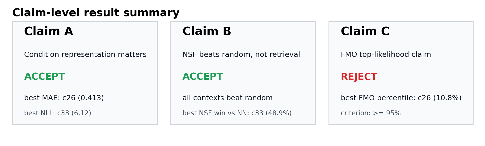
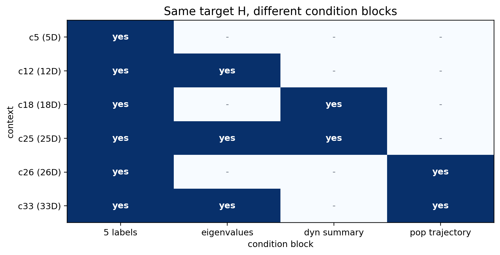
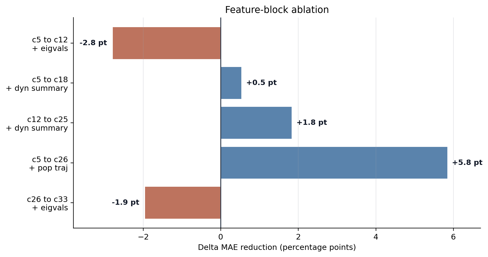
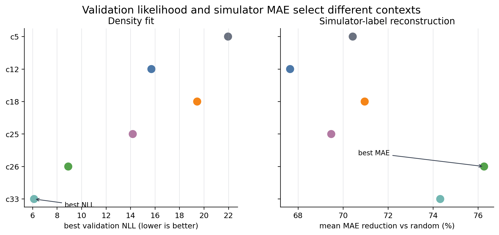
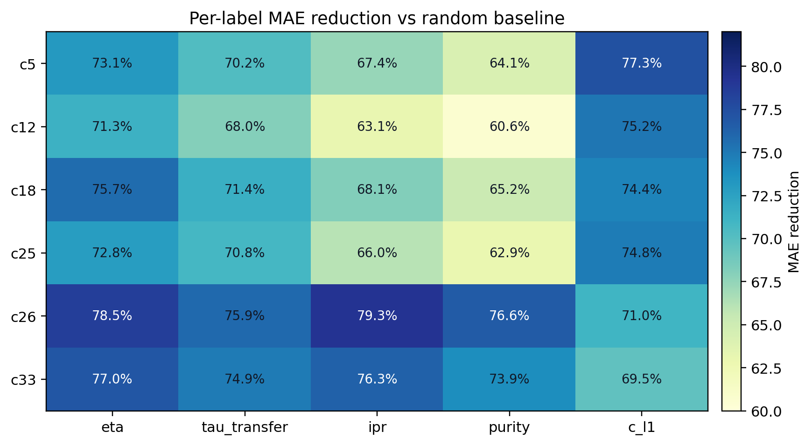
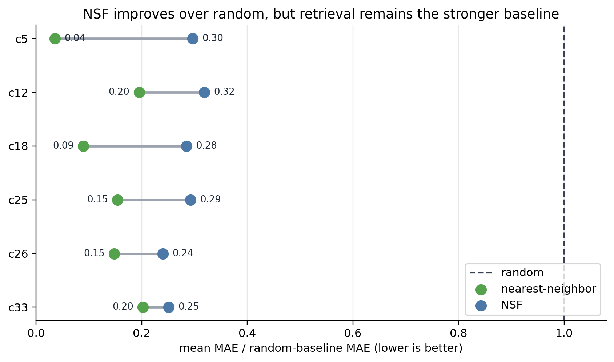
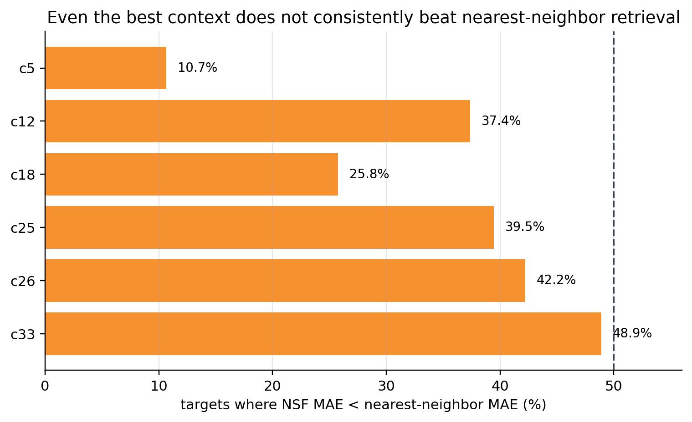
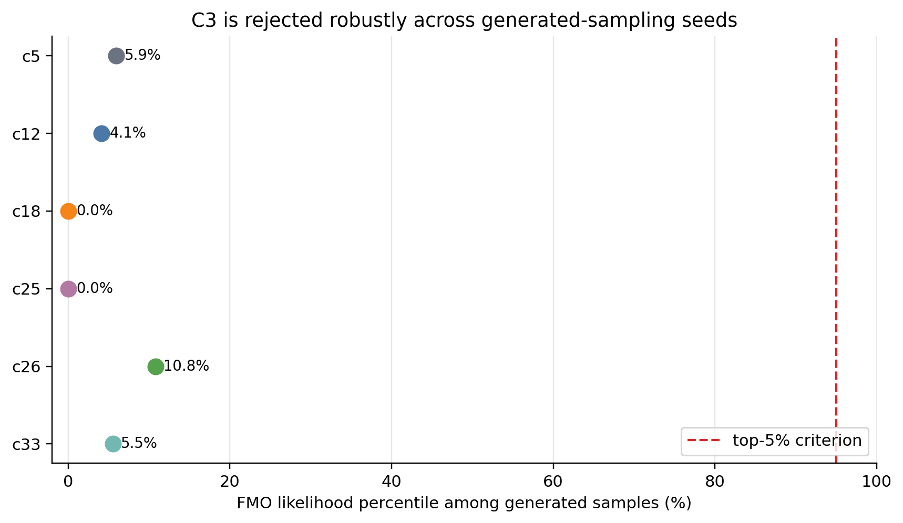
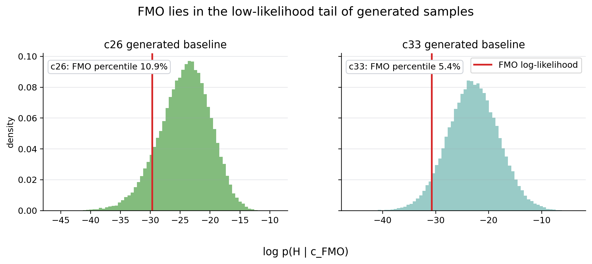
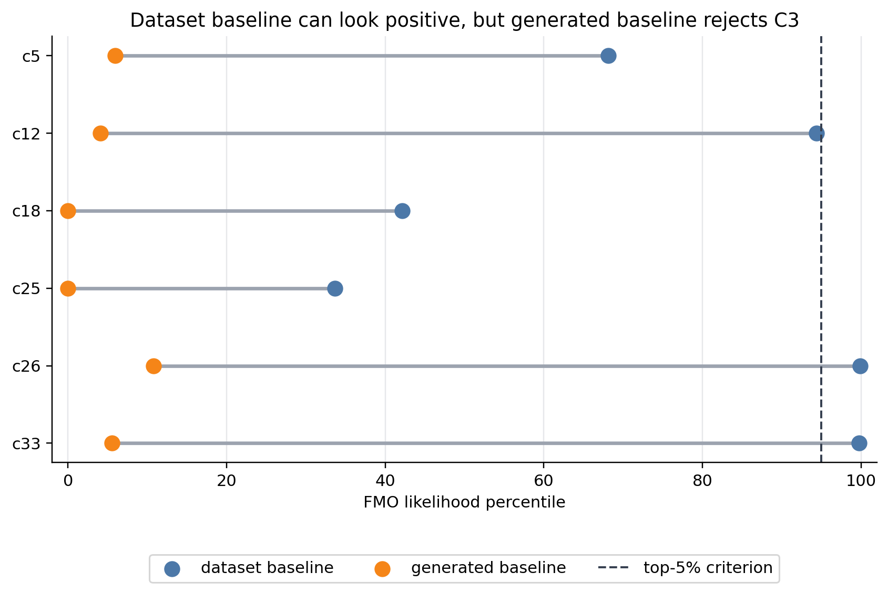

# H27 Context Ablation: Claim 중심 결과 요약

이 문서는 생성 대상 `H`를 27차원 Hamiltonian으로 고정하고, condition `c`의 구성을 바꿨을 때 어떤 주장이 데이터로 지지되는지 정리한 것이다. 핵심은 모델 구조를 바꿔서 성능을 끌어올리는 것이 아니라, 같은 `p(H | c)` 문제에서 condition 표현이 결과 해석에 어떤 차이를 만드는지 확인하는 데 있다.

이 첫 그림은 아래 세 claim의 최종 판정만 압축해서 보여주는 요약 그림이다. 여기서의 판정은 모두 같은 140k dataset H에서 학습한 NSF 모델을 기준으로 하되, 평가 대상 H의 출처는 claim마다 다르다. Claim A/B는 validation target condition에서 새로 뽑은 model-generated H를 simulator로 재평가한 결과이고, Claim C는 실제 FMO H와 FMO-conditioned generated H의 likelihood 순위를 비교한 결과다.

| claim | 검증 질문 | 판정 | 핵심 근거 |
|---|---|---|---|
| A | condition 표현은 조건부 생성 성능에 영향을 주는가? | 채택 | best MAE는 `c26`, best validation NLL은 `c33`으로, context 구성에 따라 성능 순서가 달라짐 |
| B | NSF는 random sampling보다 낫지만 nearest-neighbor retrieval을 일관되게 이기지는 못하는가? | 채택 | 모든 context에서 random보다 좋지만, NN 대비 승률은 최고 `c33`도 48.9% |
| C | 실제 FMO Hamiltonian은 `p(H \| c_FMO)`의 top-likelihood sample인가? | 기각 | generated baseline 기준 최고 FMO percentile이 `c26`의 10.8%로, 95% 기준에 크게 못 미침 |

## 1. 실험 설정

| 항목 | 설정 | 의미 |
|---|---:|---|
| target | 27D Hamiltonian `H` | 생성 대상은 원래 문제인 `p(H \| c)` 그대로 유지 |
| model | NSF normalizing flow | 조건부 분포 `p(H \| c)`를 학습 |
| dataset | 140,000 samples | 기존 H27 데이터셋 병합본 사용 |
| split | fixed train/validation split | 같은 seed에서는 context가 달라도 동일한 split 사용 |
| checkpoint | best validation NLL | 마지막 epoch가 아니라 검증 NLL이 가장 좋았던 epoch 저장 |
| epochs | 1000 | context마다 수렴 시점이 달라 넉넉하게 설정 |
| early stopping | patience 100 | 검증 성능이 오래 개선되지 않을 때만 중단 |
| scheduler | ReduceLROnPlateau | 검증 성능 정체 시 learning rate 감소 |
| simulation MAE target | 1,000 held-out validation samples | 학습에 쓰지 않은 validation target만 재시뮬레이션 평가에 사용 |

여기서 held-out validation sample은 학습에 직접 사용하지 않은 샘플을 뜻한다. 다만 validation sample도 같은 데이터 생성 prior에서 나온 in-distribution sample이다. 그래서 이 평가는 모델이 전혀 다른 외부 분포를 일반화하는지 보는 실험이 아니라, 같은 데이터 분포 안에서 조건을 만족하는 Hamiltonian을 얼마나 잘 생성하는지 보는 실험이다.

이 문서에서 등장하는 `H`의 출처는 다음처럼 구분한다.

| 이름 | 출처 | 사용 위치 |
|---|---|---|
| dataset H | 병합된 140,000개 데이터셋에 저장된 Hamiltonian | 학습, validation NLL, C3 dataset baseline |
| validation target H | dataset H 중 validation split에서 뽑은 1,000개 target | MAE 평가의 목표 label 제공 |
| model-generated H | 각 target condition을 넣고 NSF에서 새로 샘플링한 Hamiltonian | NSF MAE 평가 |
| random-prior H | condition을 보지 않고 `sample_H_geom` prior에서 새로 뽑은 Hamiltonian | random baseline |
| NN-retrieved H | target condition과 가장 가까운 training split의 dataset H | nearest-neighbor baseline |
| FMO H | 실제 Adolphs-Renger FMO Hamiltonian | C3 biological likelihood 평가 |
| FMO-conditioned generated H | `c_FMO`를 넣고 NSF에서 새로 샘플링한 Hamiltonian | C3 generated baseline |

따라서 아래의 MAE 실험은 "dataset H 자체를 다시 맞추는지"만 보는 것이 아니다. 각 validation target의 condition을 모델에 넣어 새 Hamiltonian을 생성하고, 그 생성된 Hamiltonian을 simulator로 다시 돌린 뒤 target label과 비교한다. 반면 validation NLL은 생성 샘플이 아니라 validation split에 이미 있는 dataset H를 모델이 얼마나 높은 확률로 설명하는지를 본다.

condition 후보는 아래처럼 구성했다.

이 그림은 Hamiltonian 자체가 아니라 condition `c`의 구성만 비교한다. 모든 실험에서 생성 대상은 27D Hamiltonian `H`로 고정되어 있고, 이 그림의 각 row는 NSF에 입력되는 condition vector가 어떤 정보를 포함하는지를 나타낸다. 즉 `c5`, `c12`, `c18`, `c25`, `c26`, `c33`은 서로 다른 데이터셋이 아니라 같은 dataset H에 대해 서로 다른 condition 표현을 붙인 것이다.

| context | dim | 포함 정보 | 해석상 주의점 |
|---|---:|---|---|
| c5 | 5 | original labels | 원래 proposal에 가장 가까운 최소 condition |
| c12 | 12 | c5 + sorted eigenvalues | H의 spectrum 정보를 추가 |
| c18 | 18 | c5 + dynamics summary | simulator-derived summary를 추가 |
| c25 | 25 | c5 + eigenvalues + dynamics summary | c12와 c18의 결합 |
| c26 | 26 | c5 + selected population trajectory | trajectory 정보가 H 후보를 강하게 제한 |
| c33 | 33 | c26 + eigenvalues | 가장 강한 condition |

`c26`과 `c33`은 selected population trajectory를 condition에 포함한다. 이 정보는 Hamiltonian을 시뮬레이션해서 얻는 값과 가까우므로, 원래 5D condition보다 훨씬 강한 조건이다. 따라서 `c26/c33`의 성능 향상은 "모델이 더 깊은 물리 법칙을 발견했다"기보다 "condition에 들어간 정보가 Hamiltonian 후보 공간을 더 강하게 좁혔다"로 해석하는 것이 안전하다.

## 2. Claim A: Condition 표현은 성능에 영향을 준다

**판정: 채택.**

같은 NSF 모델과 같은 27D target을 사용해도 condition block에 따라 결과가 달라졌다. 특히 차원을 키우는 것이 항상 좋은 것은 아니고, 어떤 정보가 들어갔는지가 중요했다.

| context | dim | best val NLL | mean MAE | MAE reduction vs random | win rate vs random |
|---|---:|---:|---:|---:|---:|
| c5 | 5 | 21.96 | 0.510 | 70.4% | 80.8% |
| c12 | 12 | 15.70 | 0.548 | 67.6% | 79.8% |
| c18 | 18 | 19.44 | 0.489 | 71.0% | 81.1% |
| c25 | 25 | 14.18 | 0.503 | 69.5% | 80.7% |
| c26 | 26 | 8.91 | 0.413 | 76.3% | 85.1% |
| c33 | 33 | 6.12 | 0.432 | 74.3% | 82.9% |

이 그림은 특정 feature block을 condition에 추가했을 때 평균 MAE reduction이 얼마나 변하는지 보여준다. 비교에 쓰인 H는 validation dataset H 자체가 아니라, 각 validation target condition에서 NSF가 새로 생성한 model-generated H다. 가로축은 MAE reduction의 변화량이며, 0보다 오른쪽이면 feature 추가 후 model-generated H의 simulator MAE가 개선된 것이고 왼쪽이면 오히려 나빠진 것이다. `population trajectory`를 추가한 `c26`은 `c5` 대비 +5.8%p 개선되어 가장 큰 효과를 보였다. 반대로 eigenvalue만 추가한 `c12`는 `c5`보다 MAE reduction이 2.8%p 낮아졌고, `c26`에 eigenvalue를 추가한 `c33`도 MAE 기준으로는 1.9%p 낮아졌다. 즉 eigenvalue가 likelihood fit에는 도움이 될 수 있지만, 생성 샘플을 다시 simulator label로 평가했을 때 항상 도움이 되는 것은 아니다.

여기서 MAE reduction은 validation target H 자체의 오차가 아니다. 각 validation target의 condition을 NSF에 넣어 model-generated H를 만들고, 그 H를 simulator로 다시 돌려 얻은 label이 target label과 얼마나 가까운지를 본 값이다. random 기준은 같은 target condition을 무시하고 random-prior H를 만들어 비교한 것이다.

이 그림은 두 평가 축이 완전히 같은 결론을 주지 않는다는 점을 보여준다. 왼쪽 NLL 패널은 validation split에 들어 있는 dataset H를 대상으로 한다. 즉 모델이 학습에 쓰지 않은 실제 validation H를 얼마나 높은 확률로 설명하는지 보는 지표다. 오른쪽 MAE 패널은 model-generated H를 대상으로 한다. validation target의 condition을 넣어 새 H를 샘플링하고, 그 H를 simulator로 돌려 target label과 비교한다. 그래서 validation NLL은 `c33`이 가장 좋지만, simulator MAE 기준으로는 `c26`이 가장 좋다.

label별로 나누어 보면 `c26/c33`은 `eta`, `tau_transfer`, `ipr`, `purity`에서 강하다. 이 heatmap의 각 값도 validation target H의 기존 label과 model-generated H를 다시 시뮬레이션해서 얻은 label 사이의 오차를 기준으로 계산했다. 색이 진할수록 random-prior H 대비 오차 감소가 큰 label이다. 다만 `c_l1`에서는 `c5/c12`도 상대적으로 좋은 편이라, 평균 MAE만 보면 일부 label별 차이가 가려진다. 최종 보고서에서는 "어떤 context가 모든 면에서 압도적으로 좋다"가 아니라, "condition block에 따라 likelihood fit과 simulator-label 재현 성능이 다르게 움직인다"라고 쓰는 편이 정확하다.

population trajectory를 제외한 condition만 보면 `c18`이 평균 MAE 0.489로 가장 좋다. 따라서 더 엄격하게 "simulation-derived population trajectory를 condition에 넣지 않은 경우"로 제한하면, dynamics summary가 eigenvalue-only 구성보다 label 재현에 더 직접적으로 도움이 된다고 볼 수 있다. 반면 validation NLL 기준에서는 `c25`와 `c12`가 `c18`보다 좋다. 이 차이는 density fitting과 downstream simulation 재현을 분리해서 평가해야 한다는 근거다.

## 3. Claim B: NSF는 random보다 낫지만 NN retrieval을 일관되게 이기지는 못한다

**판정: 채택.**

random baseline은 condition을 전혀 보지 않고 geometry-based prior에서 새 Hamiltonian을 뽑는 기준이다. 즉 dataset에서 임의로 하나를 가져오는 것이 아니라, `sample_H_geom`로 random-prior H를 생성하고 그것을 simulator로 돌린다. NSF가 random보다 낮은 MAE를 보이면, 모델이 condition 정보를 활용하고 있다는 최소한의 증거가 된다.

nearest-neighbor baseline은 더 강한 기준이다. target condition과 가장 가까운 training split의 dataset H를 찾아 그 sample의 label을 target label과 비교한다. 새 Hamiltonian을 생성하는 모델은 아니지만, target이 같은 데이터 생성 prior 안에 있는 in-distribution sample일 때는 매우 강한 retrieval baseline이다.

| context | NSF MAE / random | NN MAE / random | NSF win rate vs NN |
|---|---:|---:|---:|
| c5 | 0.30 | 0.04 | 10.7% |
| c12 | 0.32 | 0.20 | 37.4% |
| c18 | 0.28 | 0.09 | 25.8% |
| c25 | 0.29 | 0.15 | 39.5% |
| c26 | 0.24 | 0.15 | 42.2% |
| c33 | 0.25 | 0.20 | 48.9% |

모든 context에서 NSF의 `MAE / random MAE`는 1보다 훨씬 작다. 여기서 NSF 점은 target condition으로 생성한 model-generated H의 오차이고, random 점은 condition을 무시하고 생성한 random-prior H의 오차다. 따라서 NSF는 random sampling보다 명확히 낫다. 하지만 NN은 대부분의 context에서 NSF보다 더 낮은 MAE를 보인다. 특히 `c5`에서는 NN이 random 대비 0.04 수준까지 내려가므로 retrieval이 매우 강하다.

NSF가 NN을 이긴 비율은 `c33`에서 48.9%로 가장 높지만, 50%를 넘지는 못한다. 이 비율은 같은 1,000개 validation target에 대해 model-generated H의 label 오차가 NN-retrieved H의 label 오차보다 작은 경우의 비율이다. 즉 "NSF가 random보다 낫다"는 주장은 지지되지만, "NSF가 기존 데이터 retrieval보다 낫다"는 강한 주장은 현재 결과로는 지지되지 않는다. 이 결과는 모델 실패라기보다 평가 상황의 성격을 보여준다. validation target이 데이터셋 내부 분포에서 나왔기 때문에, 가까운 training sample을 직접 가져오는 NN 방식이 구조적으로 유리하다.

## 4. Claim C: FMO는 top-likelihood generated sample인가?

**판정: 기각.**

Claim C의 원래 의미는 실제 FMO Hamiltonian이 학습된 조건부 분포 `p(H | c_FMO)` 안에서 높은 likelihood를 갖는지 확인하는 것이다. 여기서 `c_FMO`는 실제 FMO H를 simulator로 돌려 만든 condition이다. 이를 직접 보려면 `c_FMO`를 모델에 넣어 새로 생성한 FMO-conditioned generated H들을 baseline으로 삼고, 실제 FMO H의 log-likelihood가 그 분포 안에서 어느 위치인지 봐야 한다.

여기서 percentile은 "baseline sample 중 FMO보다 log-likelihood가 낮거나 같은 비율"이다. 95%라면 FMO가 baseline 안에서 상위 5% likelihood sample이라는 뜻이고, 10%라면 baseline sample의 약 90%가 FMO보다 더 높은 likelihood를 가진다는 뜻이다.

generated baseline 기준으로 가장 높은 값은 `c26`의 10.8%다. 이 값은 전체 데이터셋 H와 비교한 순위가 아니라, `c_FMO` 조건에서 모델이 직접 샘플링한 FMO-conditioned generated H들과 실제 FMO H를 비교한 순위다. 나머지 context도 모두 95% 기준에 크게 못 미친다. seed를 5개로 바꿔 반복해도 이 결론은 변하지 않았다. `c26`의 seed별 범위는 10.67-10.92%, `c33`의 범위는 5.31-5.69%였다.

위 그림은 그 이유를 더 직접적으로 보여준다. 여기서 막대 분포를 이루는 H들은 전체 데이터셋의 H가 아니라, `c_FMO` 조건을 넣고 NSF 모델에서 새로 샘플링한 FMO-conditioned generated H들이다. 가로축은 각 FMO-conditioned generated H가 `c_FMO` 조건에서 받은 log-likelihood, 즉 `log p(H | c_FMO)`다. 오른쪽에 있을수록 모델이 그 Hamiltonian을 더 그럴듯하다고 본다. 세로축은 FMO-conditioned generated H들의 density다. 단순 개수가 아니라 histogram 전체 면적이 1이 되도록 정규화한 밀도이므로, 막대의 높이는 상대적인 분포 모양을 보기 위한 값이다. 빨간 세로선은 generated H가 아니라 실제 FMO Hamiltonian의 log-likelihood 위치다.

`c26`과 `c33` 모두에서 빨간 선은 FMO-conditioned generated H 분포의 왼쪽 tail에 놓인다. 즉 모델이 `c_FMO` 조건에서 직접 생성하는 Hamiltonian들보다 FMO의 likelihood가 낮은 편이다. 그래서 generated baseline 기준 FMO percentile이 각각 10.8%, 5.5%에 머문다.

| context | dataset baseline percentile | generated baseline percentile | top 5% claim |
|---|---:|---:|---|
| c5 | 68.17% | 5.95% | 불만족 |
| c12 | 94.40% | 4.12% | 불만족 |
| c18 | 42.12% | 0.00% | 불만족 |
| c25 | 33.67% | 0.00% | 불만족 |
| c26 | 99.93% | 10.79% | 불만족 |
| c33 | 99.77% | 5.52% | 불만족 |

dataset baseline과 generated baseline은 서로 다른 질문에 답한다. Dataset baseline은 모델이 생성한 H가 아니라, 기존 140,000개 데이터셋에서 뽑은 dataset H들을 `c_FMO` 조건에서 점수 매겼을 때 FMO가 어디에 있는지를 본다. 이 기준에서는 `c26/c33`에서 FMO가 99% 이상으로 높다. 하지만 Claim C의 직접 검증은 generated baseline이다. `H_gen ~ pθ(H | c_FMO)`로 모델이 실제 생성한 샘플들과 비교해야 "학습된 조건부 생성분포 안에서 FMO가 typical한가"를 말할 수 있다. 이 기준에서는 모든 context가 95%를 만족하지 못했다.

따라서 Claim C는 현재 결과로 기각하는 것이 맞다. 다만 dataset baseline에서 FMO가 높게 나타나는 현상은 완전히 버릴 결과는 아니다. 이는 FMO가 전체 데이터셋의 무작위 Hamiltonian보다는 특정 condition에서 더 그럴듯하게 평가될 수 있음을 보여주는 보조 관찰이다. 하지만 그 보조 관찰만으로 "FMO가 생성분포의 top-likelihood sample"이라고 주장할 수는 없다.

## 5. 최종 해석

이 실험 묶음에서 가장 안전하게 말할 수 있는 결론은 다음과 같다.

1. `p(H | c)`에서 condition 표현은 결과를 크게 바꾼다. 특히 population trajectory를 포함하면 Hamiltonian 후보 공간이 크게 좁아져 MAE가 좋아진다.
2. NSF는 condition 정보를 활용해 random sampling보다 좋은 Hamiltonian을 생성한다. 다만 in-distribution target에서는 nearest-neighbor retrieval이 매우 강한 baseline이며, NSF가 이를 일관되게 넘지는 못한다.
3. 실제 FMO Hamiltonian이 학습된 generated distribution의 top-likelihood sample이라는 강한 주장은 현재 결과로 지지되지 않는다.

최종 보고서에서는 이 결과를 단순히 "성공" 또는 "실패"로 쓰기보다, inverse design 평가에서 condition choice와 baseline choice가 결론을 크게 바꾼다는 근거로 쓰는 것이 좋다. 지지되는 주장은 condition representation의 중요성과 random 대비 NSF의 개선이고, 지지되지 않는 주장은 FMO top-likelihood claim이다.
